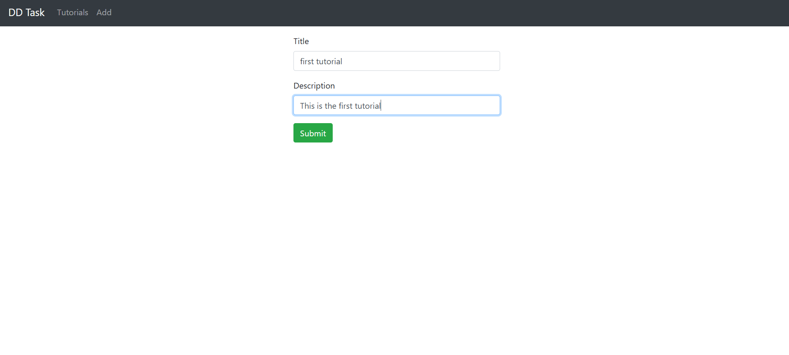
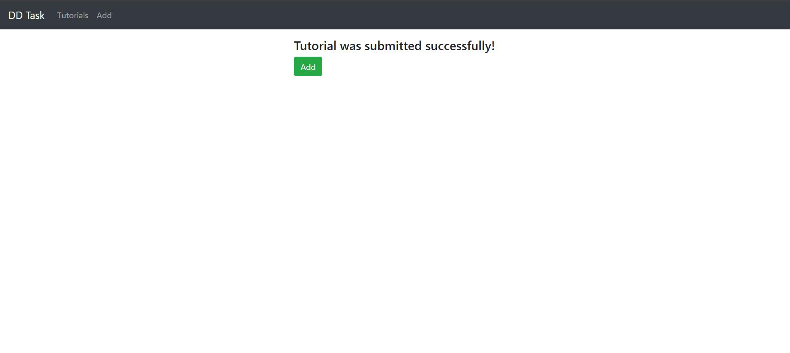
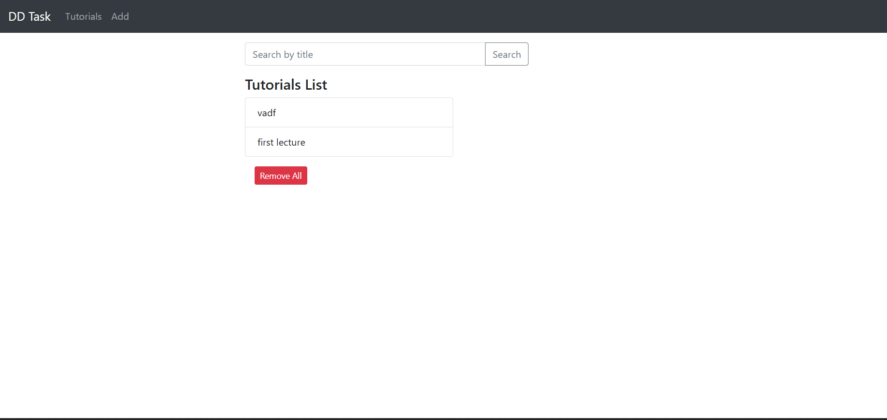

# Full Stack App

A full-stack web application containerized with Docker, orchestrated with Docker Compose and Kubernetes, and deployed through a Jenkins CI/CD pipeline. It uses an Angular frontend, a Node.js/Express backend, MongoDB for storage, and Nginx as a reverse proxy.

---

## Table of Contents

1. [Project Overview](#project-overview)
2. [Architecture](#architecture)
3. [Project Structure](#project-structure)
4. [Prerequisites](#prerequisites)
5. [Repository Setup](#repository-setup)
6. [Docker Setup](#docker-setup)
7. [Docker Compose Deployment](#docker-compose-deployment)
8. [Kubernetes Deployment](#kubernetes-deployment)
9. [CI/CD Pipeline Setup](#cicd-pipeline-setup)
10. [Nginx Reverse Proxy Setup](#nginx-reverse-proxy-setup)
11. [Useful Commands](#useful-commands)
12. [Troubleshooting](#troubleshooting)
13. [Screenshots](#screenshots)

---

## Project Overview

| Layer | Technology |
|-------|-----------|
| Frontend | Angular |
| Backend | Node.js / Express |
| Database | MongoDB |
| Containerization | Docker |
| Local / VM Orchestration | Docker Compose |
| Cluster Orchestration | Kubernetes |
| CI/CD | Jenkins |
| Reverse Proxy | Nginx |

The project covers the full path from source code to a running deployment: containerizing each service, running them together with Docker Compose, deploying and managing them on Kubernetes, and automating the process with CI/CD.

---

## Architecture

```
                    ┌──────────────┐
   Client ────────► │    Nginx     │  (port 80)
                    └──────┬───────┘
                 /         │          /api
          ┌────────────────┴───────────────┐
          ▼                                ▼
   ┌──────────────┐                ┌───────────────┐
   │   Frontend   │                │    Backend    │
   │  (Angular)   │                │(Node/Express) │
   └──────────────┘                └──────┬────────┘
                                          ▼
                                   ┌──────────────┐
                                   │   MongoDB    │
                                   │ (persistent) │
                                   └──────────────┘
```

The same architecture is used in both Docker Compose and Kubernetes. In Kubernetes, Nginx runs as a Deployment with its configuration provided by a ConfigMap.

---

## Project Structure

```
.
├── frontend/                  # Angular app + Dockerfile
├── backend/                   # Node.js/Express API + Dockerfile
├── nginx/                     # Nginx config (Docker Compose)
├── k8s/                       # Kubernetes manifests
│   ├── namespace.yaml
│   ├── nginx/
│   │   ├── configmap.yaml
│   │   ├── deployment.yaml
│   │   └── service.yaml
│   ├── frontend/
│   │   ├── deployment.yaml
│   │   └── service.yaml
│   ├── backend/
│   │   ├── deployment.yaml
│   │   └── service.yaml
│   └── mongodb/
│       ├── statefulset.yaml
│       └── service.yaml
├── docker-compose.yml
├── Jenkinsfile
├── screenshots/
└── README.md
```

---

## Prerequisites

- Git
- Docker and Docker Compose
- A Docker Hub account
- A Kubernetes cluster (Minikube, kind, or a cloud cluster) and `kubectl`
- Jenkins (for CI/CD)
- Ubuntu VM (for server deployment)

---

## Repository Setup

1. Create a new repository on GitHub.
2. Clone it locally:
```bash
   git clone https://github.com/satnamgrover/full-stack-app.git
   cd full-stack-app
```
3. Add your frontend and backend code to the `frontend/` and `backend/` folders.
4. Commit and push the initial code:
```bash
   git add .
   git commit -m "Initial commit"
   git push origin main
```

---

## Docker Setup

Each service has its own Dockerfile so it can run on any machine.

### Frontend

```bash
docker build -t <dockerhub-username>/frontend:latest ./frontend
docker push <dockerhub-username>/frontend:latest
```

### Backend

```bash
docker build -t <dockerhub-username>/backend:latest ./backend
docker push <dockerhub-username>/backend:latest
```

### Database

MongoDB uses the official `mongo` image from Docker Hub, so no custom Dockerfile is needed. Data is persisted with a Docker volume (Compose) or a StatefulSet volume claim (Kubernetes).

---

## Docker Compose Deployment

Docker Compose runs the frontend, backend, database, and Nginx together with a single command.

1. The `docker-compose.yml` in the project root defines these services:
   - `frontend`: Angular app image
   - `backend`: Express API image
   - `mongodb`: MongoDB with a named volume for persistent storage
   - `nginx`: reverse proxy exposing port 80
2. Start all services in detached mode:
```bash
   docker compose up -d
```
3. Verify the containers are running:
```bash
   docker compose ps
```
4. View logs:
```bash
   docker compose logs -f
```
5. Stop the services:
```bash
   docker compose down
```
   Add `-v` to also delete the MongoDB volume (this removes your data).

---

## Kubernetes Deployment

The `k8s/` folder contains one subfolder per component, plus a shared namespace.

### Resources

| Component | Files | Purpose |
|-----------|-------|---------|
| Namespace | `namespace.yaml` | Isolates all application resources |
| MongoDB | `statefulset.yaml`, `service.yaml` | StatefulSet with persistent storage and a stable network identity for the database |
| Backend | `deployment.yaml`, `service.yaml` | Runs the Express API and exposes it inside the cluster |
| Frontend | `deployment.yaml`, `service.yaml` | Runs the Angular app and exposes it inside the cluster |
| Nginx | `configmap.yaml`, `deployment.yaml`, `service.yaml` | Reverse proxy; its config is injected through a ConfigMap and it is the public entry point |

### Deploy

Apply the manifests in dependency order:

1. Make sure `kubectl` points to your cluster:
```bash
   kubectl cluster-info
```
2. Create the namespace:
```bash
   kubectl apply -f k8s/namespace.yaml
```
3. Deploy MongoDB first, since the backend depends on it:
```bash
   kubectl apply -f k8s/mongodb/
```
4. Deploy the backend and frontend:
```bash
   kubectl apply -f k8s/backend/
   kubectl apply -f k8s/frontend/
```
5. Deploy Nginx (the ConfigMap must exist before the Deployment starts):
```bash
   kubectl apply -f k8s/nginx/
```

### Verify

```bash
kubectl get all -n <namespace>
kubectl get pvc -n <namespace>
kubectl get configmap -n <namespace>
```

### Access the application

Nginx is the single entry point. How you reach it depends on the type of the `nginx` Service:

- **NodePort:** open `http://<node-ip>:<node-port>`
- **LoadBalancer:** open `http://<external-ip>`
- **Minikube:**
```bash
  minikube service nginx -n <namespace>
```

### Scaling and updates

```bash
# Scale the backend to 3 replicas
kubectl scale deployment backend --replicas=3 -n <namespace>

# Rolling update to a new image
kubectl set image deployment/backend backend=<dockerhub-username>/backend:<new-tag> -n <namespace>

# Check rollout status or roll back
kubectl rollout status deployment/backend -n <namespace>
kubectl rollout undo deployment/backend -n <namespace>

# Apply a changed Nginx config, then restart Nginx to pick it up
kubectl apply -f k8s/nginx/configmap.yaml
kubectl rollout restart deployment/nginx -n <namespace>
```

### Tear down

```bash
kubectl delete -f k8s/nginx/
kubectl delete -f k8s/frontend/
kubectl delete -f k8s/backend/
kubectl delete -f k8s/mongodb/
kubectl delete -f k8s/namespace.yaml
```

Deleting the namespace removes everything inside it. MongoDB's PersistentVolumeClaims created by the StatefulSet are not always removed when you delete the StatefulSet alone. Delete the namespace or the PVCs to clear the data.

---

## CI/CD Pipeline Setup

Jenkins automates the build, push, and deployment process.

1. Create a Jenkins pipeline job linked to the GitHub repository.
2. Trigger the pipeline on every push to the `main` branch.
3. Pipeline stages:
   - Checkout the repository
   - Log in to Docker Hub
   - Build the frontend and backend Docker images
   - Push the images to Docker Hub
   - Deploy the application using **Docker Compose** (`docker compose up -d`) or **Kubernetes** (`kubectl apply -f k8s/...` in the order above)
4. Store all secrets (Docker Hub credentials, kubeconfig) in the Jenkins Credentials store. Never hardcode them in the Jenkinsfile.

---

## Nginx Reverse Proxy Setup

Nginx uses the official `nginx` image and routes all traffic:

- Frontend served on the root path `/`
- Backend API served on `/api`

**Docker Compose:** the config in `nginx/` is mounted into the container through `docker-compose.yml`. The app is then reachable at the VM's IP address on port 80.

**Kubernetes:** the same config lives in `k8s/nginx/configmap.yaml` and is mounted into the Nginx pod. Upstreams point to the Kubernetes Service names (`frontend` and `backend`) instead of container names.

---

## Useful Commands

| Task | Command |
|------|---------|
| List running containers | `docker ps` |
| Rebuild and restart with Compose | `docker compose up -d --build` |
| View pod logs | `kubectl logs <pod-name> -n <namespace>` |
| Describe a failing pod | `kubectl describe pod <pod-name> -n <namespace>` |
| Open a shell in a pod | `kubectl exec -it <pod-name> -n <namespace> -- sh` |
| Open a Mongo shell | `kubectl exec -it mongodb-0 -n <namespace> -- mongosh` |
| Watch pods update | `kubectl get pods -n <namespace> -w` |

---

## Troubleshooting

- **Backend can't connect to MongoDB:** the connection string must use the service name (`mongodb`), not `localhost`. In Kubernetes, check that `mongodb-0` is `Running`.
- **`ImagePullBackOff`:** verify the image name and tag, and that the image is public or an `imagePullSecret` is configured.
- **`CrashLoopBackOff`:** check the logs with `kubectl logs`.
- **Nginx returns 502 / 504:** confirm the frontend and backend pods are ready and that the upstream names in the Nginx config match the Service names.
- **Nginx config changes not applied:** after editing the ConfigMap, run `kubectl rollout restart deployment/nginx -n <namespace>`.
- **MongoDB pod stuck in `Pending`:** check `kubectl get pvc -n <namespace>` and make sure the cluster has a default StorageClass.
- **Data lost after restart:** make sure the volume (Compose) or volumeClaimTemplate (StatefulSet) is configured for MongoDB.

---

## Screenshots






